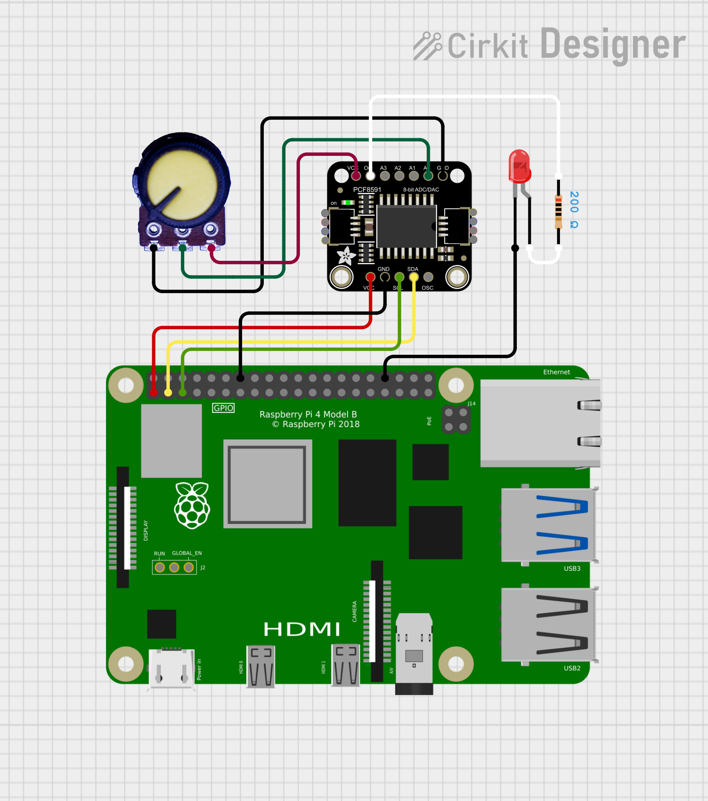

# Controlling an LED's brightness with 10K potentiometer connected to the PCF8591 ADC / DAC chip

This sample application demonstrates how to use a PCF8591
chip with the RaspBerry PI 4B to read the resistance of a 10K
potentiometer, and feed that value to the PCF8591 analog
output to control the brightness of an LED.

Both the [C](./c) and [Python](./python) versions read the
potentiometer value and print it, and then use that value to
set the analog output voltage.  Once the value exceeds 128 or
thereabouts, you should see most LEDs turn on dimly and then get brighter as the value approaches 255.

## Circuit

This diagram shows a representation of a circuit that can be wired up before running the sample app.

The circuit diagram is leveraging the following part from Adafruit:

[Adafruit PCF8591 Quad 8-bit ADC + 8-bit DAC - STEMMA QT / Qwiic](https://www.adafruit.com/product/4648)

but testing for the code used another board with the same chip from Amazon.ca from Gump's Grocer:

[Gump's grocery AD/DA PCF8591 Converter Module for Arduino Raspberry Pi](https://www.amazon.ca/Gumps-grocery-PCF8591-Converter-Raspberry/dp/B082W8WV97)

This board comes with a trim pot and some additional sensors built-in but removing some jumpers will allow for connecting the chips inputs and outputs to external devices.

### Connections

#### RaspBerry PI 4 to PCF8591 board

Pin 14 (GND) to PCF8591 board GND
Pin  1 (3.3V) to PCF8591 board VCC
Pin  2 (I2C1 SDA) to PCF8591 board SDA
Pin  3 (I2C1 SDL) to PCF8591 board SDL
Pin 34 (GND) to LED cathode

#### external 10K potentiometer to PCF8591 board

middle pin to PCF8591 board AIN0
left and right pins to GND and Vcc from PCF8591 board or breadboard

#### LED to PCF8591 board

LED anode to resistor and then connect other end of resistor to PCF8591 board AOUT pin

#### Gump's Grocer board potentiometer connections

This board has a built-in 10K trim pot
that is connected to AIN0 via a jumper connecting it to the outer pin adjacent to it on the board by default.

If you do want to connect an external pot instead, remove the jumper from AIN0
and then connect the middle pin of the external pot to AIN0.
