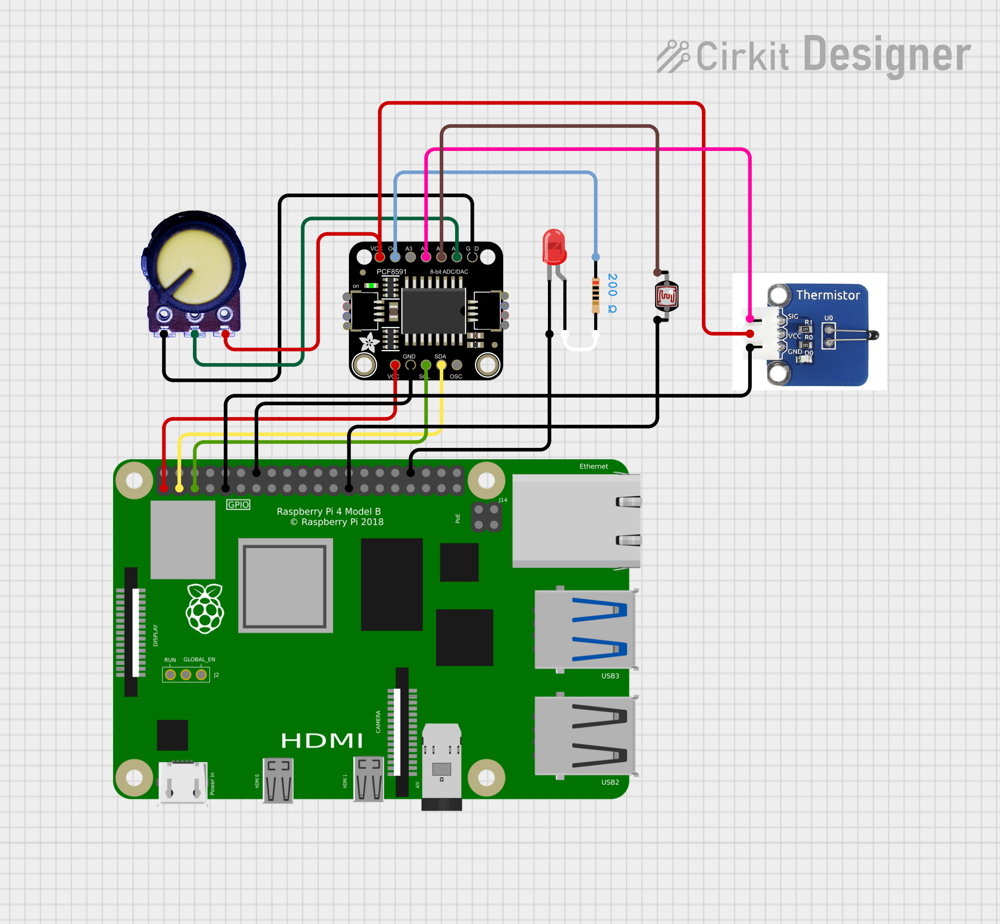

# Reading multiple devices from the Gump's Grocer PCF8591 board

This sample application demonstrates how to use a PCF8591 chip with the RaspBerry PI 4B
to read the values from the different devices incorporated into the Gump's Grocer PC8951 board.

The board incorporates:

- a 10K trim potentiometer on AIN0
- a 5537 photoresistor
- a MF58 thermistor

The [C](./c) version demonstrates how to read the device data individually or as a block of four data bytes.

The [Python](./python) version demonstrates how to read the device data individually.

## Circuit

This diagram shows a representation of a circuit that can be wired up before running the sample app.

The circuit diagram is leveraging the following part from Adafruit:

[Adafruit PCF8591 Quad 8-bit ADC + 8-bit DAC - STEMMA QT / Qwiic](https://www.adafruit.com/product/4648)

but testing for the code used another board with the same chip from Amazon.ca from Gump's Grocer:

[Gump's grocery AD/DA PCF8591 Converter Module for Arduino Raspberry Pi](https://www.amazon.ca/Gumps-grocery-PCF8591-Converter-Raspberry/dp/B082W8WV97)

This board comes with a trim pot and some additional sensors built-in but removing some jumpers will allow for connecting the chips inputs and outputs to external devices.

### Connections

#### RaspBerry PI 4 to PCF8591 board

Pin 14 (GND) to PCF8591 board GND
Pin  1 (3.3V) to PCF8591 board VCC
Pin  2 (I2C1 SDA) to PCF8591 board SDA
Pin  3 (I2C1 SDL) to PCF8591 board SDL

Note: The connections below on the diagram are not needed
for the Gump's Grocer PCF8591 board as all of three devices listed above are already integrated into the board and connected to the PC8591 chip if the jumpers remain in place.

Pin 34 (GND) to LED cathode
Pin  9 (GND) to thermistor GND
Pin 25 (GND) to photoresistor GND
